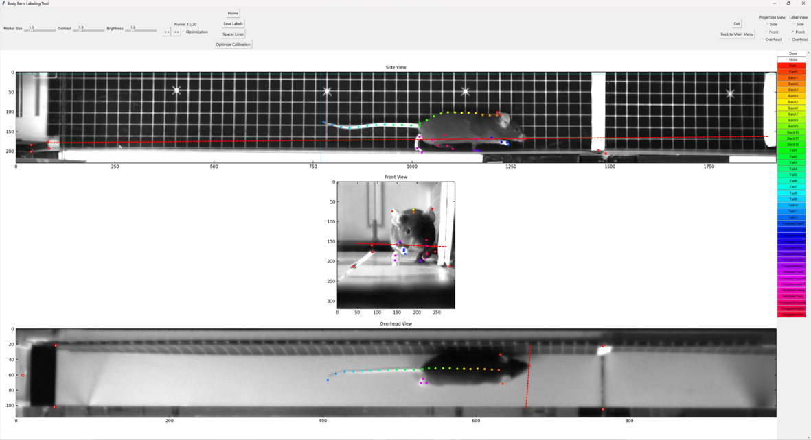

# 3D Annotation GUI

### Multi-camera labelling tool with 3D projection assistance

A tkinter-based GUI for manual annotation of body parts across three synchronized camera views (side, front, overhead),
with real-time 3D projection lines to guide labelling.

<p align="center">
  <br>
  <em>The annotation interface: three synchronized camera views with real-time 3D projection lines to guide body part labelling.</em>
</p>

<p align="center">
  <br>
  <em>Downstream result: labels produced with this tool were used to train DeepLabCut models (single model per camera). These multi-view predictions are then triangulated to reconstruct 3D motion.</em>
</p>

_Note: This is a personal research tool. Future work will focus on generalising the pipeline so it can be released as a
reusable package._

## Setup

Create environment:

```bash
conda env create -f environment.yml
```

Run the GUI:

```bash
# First set the "dir" path in annotation_tool/config.py to point to your data directory.

conda activate 3d-annotation-gui
python -m annotation_tool
```

Run tests:

```bash
pytest tests/ -v
```

## Project structure

```
annotation_tool/
├── __main__.py              # Entry point (python -m annotation_tool)
├── config.py                # User settings, labels, paths
├── camera/
│   ├── calibration.py       # BasicCalibration wrapper
│   └── reconstruction.py    # CameraData, BeltPoints, 3D geometry
└── gui/
    ├── app.py               # Main menu window
    ├── base.py              # Shared base class (pan, zoom, crosshair, sliders)
    ├── extract.py           # Frame extraction from synchronized videos
    ├── calibrate.py         # Camera calibration point labelling
    ├── label.py             # Body part labelling with 3D projections
    ├── utils.py             # Pure utility functions
    └── sync.py              # Timestamp synchronization and frame matching
tests/
├── test_config.py           # Config consistency checks
└── test_gui_utils.py        # Utility function tests
```

## Tools

### Extract Frames

_Choose video frames to be labelled._

- Choose a video file from the pop-up file manager.
- Scroll or skip through the synchronized videos to extract frame trios for labelling.
- In the case of frame misalignment across cameras, timestamps are used to correct alignment.

### Calibrate Cameras

_Label known landmarks across all three camera views for camera pose estimation (via OpenCV's `solvePnP`)._

- Choose a video file from the pop-up file manager (pick one for which you have already extracted, or plan to
  extract, frames).
- Scroll through the video and label the calibration points in each camera view.
- **Calibration landmarks:** the 4 corners of the first belt, the corners of the starting step edge, and the `x`
  sticker on the door.

**Controls:** Right-click to place, Shift+Right-click to delete, Left-click drag to move.

### Label Body Parts

_Label pre-defined body parts, with 3D projection estimates of each point displayed across the camera views to guide
placement._

- Choose a video folder under the `CameraCalibration` directory from the pop-up file manager, to open a video for
  which you have both extracted frames and added calibration labels.
- **Label View** — select the camera view to label in.
- **Projection View** — select the view to calculate projection lines from. If labels are present in the selected
  Projection View, estimated projection lines (from the camera centre and crossing through the platform edges) will
  display on the other two views to guide labelling.
- **Spacer Lines** — click once, then right-click two points on the active frame. 12 equally-spaced lines along the
  x-axis will be displayed.
- **Optimize Calibration** — adjusts the manually labelled calibration points to minimize reprojection error between
  camera views, improving the estimated projections.
- **Save Labels** — saves the labels to the video folder under the respective camera names (`Side`, `Front`,
  `Overhead`).

**Controls:** Right-click to place, Shift+Right-click to delete, Left-click drag to move, Hover for label name.
